# Stay Strong

[](LICENSE)

Application Android **hors ligne** pour un circuit au poids de corps :

**Tractions → Pompes → Squats → Killy → Gainage**

Programmes par niveaux, chrono de repos, saisie des séries max, séance complète, agenda avec historique, articles, export/import.

<p align="center">
  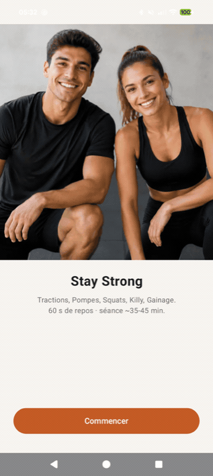
</p>

<p align="center">
  <em>Aperçu : démarrage → entraînement → niveaux → séance → agenda → articles</em>
</p>

---

## Captures d’écran

| Accueil | Entraînement | Articles |
|:---:|:---:|:---:|
| 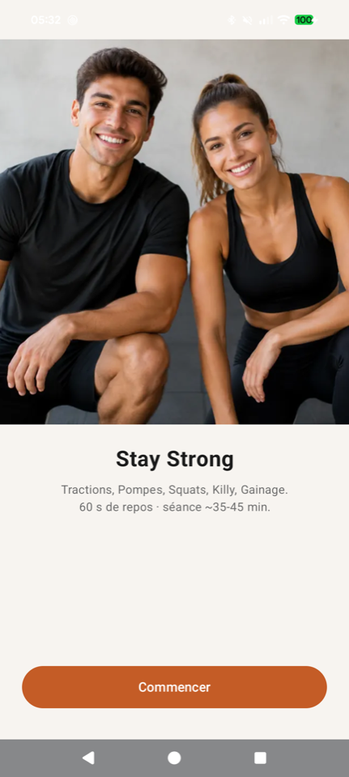 | 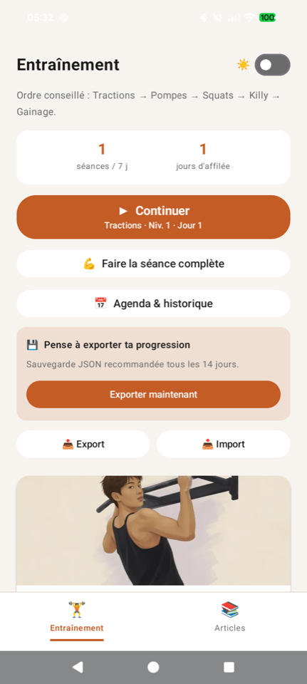 | 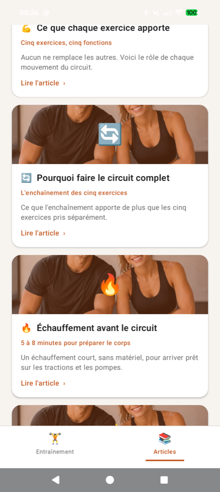 |

| Niveaux | Jours | Détail du jour |
|:---:|:---:|:---:|
| 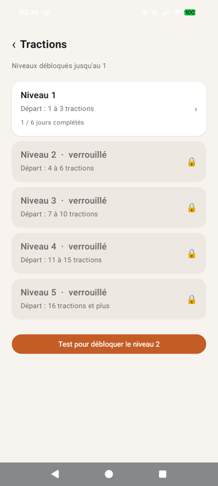 | 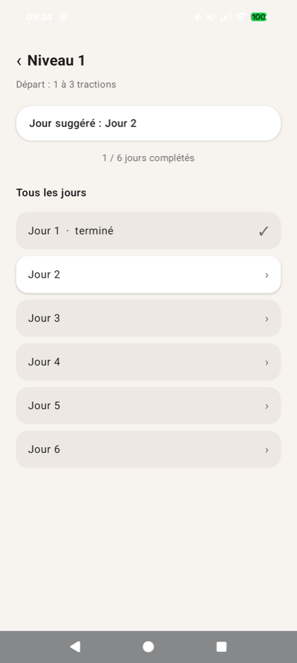 | 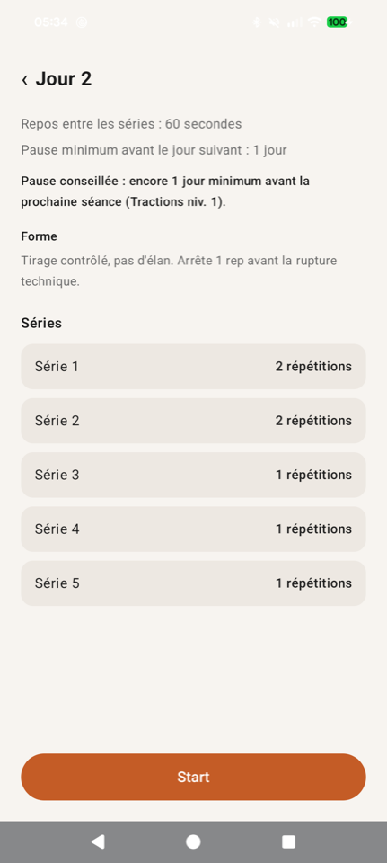 |

| Séance | Agenda | Séance complète |
|:---:|:---:|:---:|
| 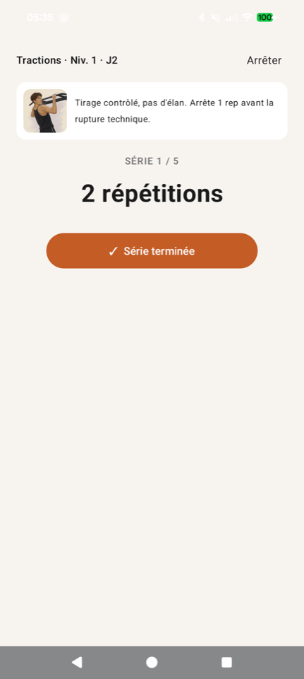 | 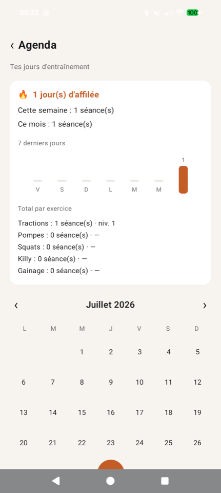 | 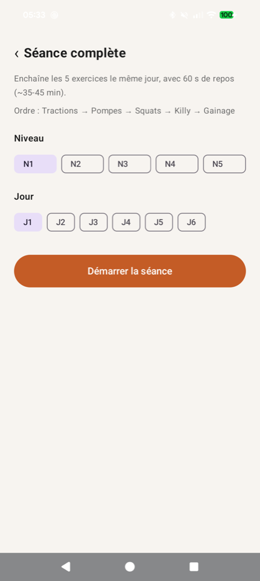 |

| Lecture d’article |
|:---:|
| 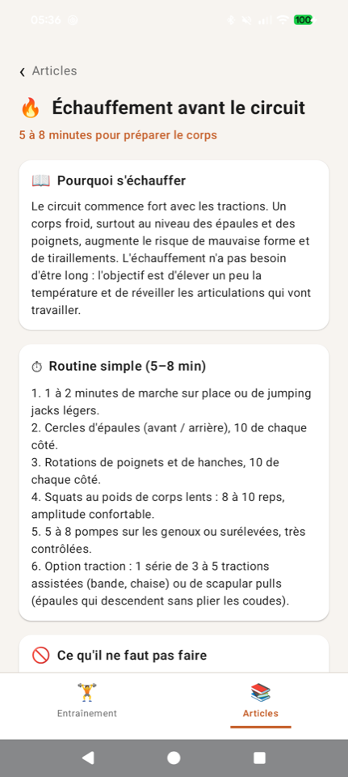 |

---

## Démos animées (GIF)

### Navigation footer Entraînement / Articles

<p align="center">
  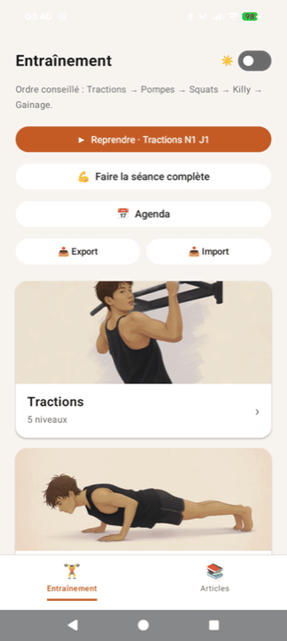
</p>

### Lancer une séance

<p align="center">
  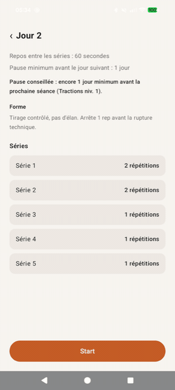
</p>

---

## Contenu du dépôt

| Dossier | Description |
|--------|-------------|
| `StayStrongApp/` | Projet Android (Kotlin + Jetpack Compose) |
| `assets/screenshots/` | Captures d’écran pour ce README |
| `assets/gifs/` | Animations GIF |
| `programmes/` | PDF sources des niveaux (5 exercices) |
| `articles/` | Guides PDF intégrés dans l’app |
| `design/` | Maquettes UI de référence |
| `docs/` | Protocole et rapports QA |

---

## Fonctionnalités

### Navigation
- **Footer** : bascule **Entraînement** / **Articles**
- Mode **sombre** optionnel (soir)

### Entraînement
- 5 exercices, 5 niveaux chacun
- Gros bouton **Continuer** (dernier exercice + niveau + jour)
- Mini-stats : séances sur 7 jours + **streak** (jours d’affilée)
- Jour suggéré, détail des séries, consigne de forme
- **Séance** : séries fixes, **saisie des reps sur les max**, maintien chrono (Killy / Gainage), repos 60 s
- Couleurs distinctes : **cuivre** (effort), **vert** (repos), **jaune** (série suivante)
- Image de l’exercice + phrase de forme pendant la série
- **Pause / Reprendre**, **Passer le chrono**
- **Séance complète** : les 5 exercices le même jour
- Tests de passage pour débloquer le niveau suivant
- Toast **« Progression sauvegardée »** en fin de jour
- Rappel d’**export JSON** (tous les 14 jours environ)
- **Export / import** JSON (presse-papiers + partage)

### Agenda & historique
- Calendrier des jours d’entraînement
- Streak, séances de la semaine et du mois
- Graphique simple des **7 derniers jours**
- Total de séances et dernier niveau **par exercice**
- Détail des reps max enregistrées (ex. `S5: 12`)

### Articles
1. *Ce que chaque exercice apporte*
2. *Pourquoi faire le circuit complet*
3. *Échauffement avant le circuit*
4. *Récupération entre les jours*

### Technique
- 100 % hors ligne
- SharedPreferences pour la progression
- Respect notch / barre de navigation
- Vibration en fin de chrono
- Écran allumé pendant la séance

---

## Prérequis

- macOS, Linux ou Windows
- **JDK 17** (ou le JBR d’Android Studio) — Java 21+ peut faire échouer Gradle avec ce projet
- **Android Studio** ou SDK Android
- Téléphone (débogage USB) ou émulateur
- Min SDK **26** (Android 8.0)

---

## Ouvrir et lancer

### Android Studio
1. **File → Open**
2. Choisir le dossier **`StayStrongApp/`**
3. Laisser Gradle synchroniser
4. Run sur appareil / émulateur

### Ligne de commande

```bash
cd StayStrongApp

# tests unitaires
./gradlew :app:testDebugUnitTest

# APK debug
./gradlew :app:assembleDebug

# installer sur le téléphone
./gradlew :app:installDebug

# ouvrir l’app
adb shell am start -n fr.gaetan.pompes/.MainActivity
```

Sous Windows : `gradlew.bat` à la place de `./gradlew`.

`local.properties` (chemin du SDK) est généré par Android Studio et **n’est pas versionné**.

APK debug typique :

```
StayStrongApp/app/build/outputs/apk/debug/app-debug.apk
```

---

## Identifiants

| Champ | Valeur |
|-------|--------|
| Package | `fr.gaetan.pompes` |
| Nom affiché | Stay Strong |
| Langage | Kotlin |
| UI | Jetpack Compose + Material 3 |
| Min / target SDK | 26 / 35 |
| Activity | `MainActivity` |

---

## Structure du code (`StayStrongApp/`)

```
StayStrongApp/
├── app/
│   ├── build.gradle.kts
│   └── src/
│       ├── main/
│       │   ├── AndroidManifest.xml
│       │   ├── java/fr/gaetan/pompes/
│       │   │   ├── MainActivity.kt
│       │   │   ├── ProgrammeData.kt
│       │   │   ├── ProgressionStore.kt
│       │   │   ├── SeanceViewModel.kt
│       │   │   ├── HistoriqueStats.kt
│       │   │   ├── ArticlesData.kt
│       │   │   ├── TestsPassage.kt
│       │   │   └── ui/          # écrans Compose + FooterNav + thème
│       │   └── res/
│       ├── test/                # tests unitaires
│       └── androidTest/         # tests UI
├── build.gradle.kts
├── settings.gradle.kts
└── gradlew / gradlew.bat
```

### Rôles principaux
- **`ProgrammeData`** : niveaux, jours, séries, repos
- **`ProgressionStore`** : jours faits, agenda, export/import, Continuer, mode sombre, rappel export
- **`SeanceController` / `SeanceViewModel`** : logique de séance, chrono, saisie des max
- **`HistoriqueStats`** : streak, graphe 7 jours, totaux par exercice
- **`ArticlesData`** : contenu des 4 articles
- **`MainActivity`** : navigation, footer, vibration, toast de sauvegarde
- **Écrans `ui/`** : affichage Compose

---

## Tests

```bash
cd StayStrongApp

# unitaires
./gradlew :app:testDebugUnitTest

# instrumentés (appareil branché)
./gradlew :app:connectedDebugAndroidTest
```

Protocole QA ISTQB : [`docs/PROTOCOLE-QA-ISTQB.md`](docs/PROTOCOLE-QA-ISTQB.md).

---

## Utilisation

1. **Commencer** → écran **Entraînement**
2. **Continuer** (si une séance a déjà été commencée) ou choisir un exercice / **séance complète**
3. Niveau → jour → **Start**
4. Séries : sur une série **max**, saisir le nombre de reps puis valider
5. Repos (vert) → **Série suivante** (jaune) → fin de jour
6. **Agenda & historique** pour le calendrier et les stats
7. **Articles** pour échauffement, récupération, etc.
8. **Export** de temps en temps pour sauvegarder la progression

---

## Limites (v1)

- Pas de son (vibration + texte)
- Pas de notification en arrière-plan
- Pas de cloud (export/import JSON local uniquement)
- Progression locale à l’appareil
- Saisie des max : reps uniquement (pas de saisie manuelle du temps sur maintien max)

---

## Modifier le programme

```
StayStrongApp/app/src/main/java/fr/gaetan/pompes/ProgrammeData.kt
```

```bash
cd StayStrongApp
./gradlew :app:testDebugUnitTest :app:installDebug
```

---

## Licence

[](LICENSE)

Copyright 2026 Gaetan Pruvot.

Distribué sous la licence **Apache License 2.0**. Voir le fichier [`LICENSE`](LICENSE).

Projet personnel d'entraînement : le code et les ressources du dépôt sont réutilisables selon les termes Apache 2.0.
